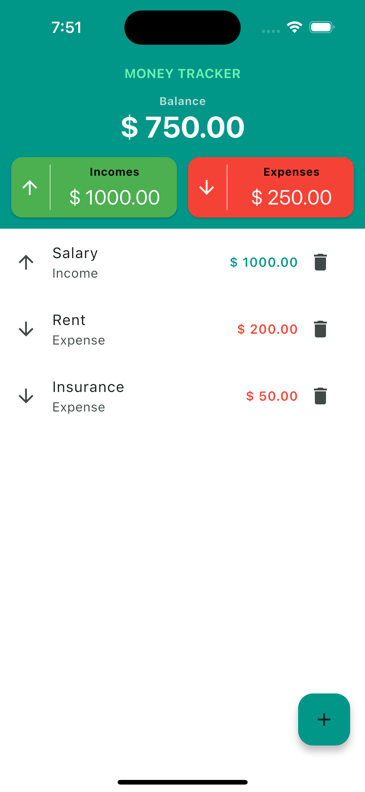
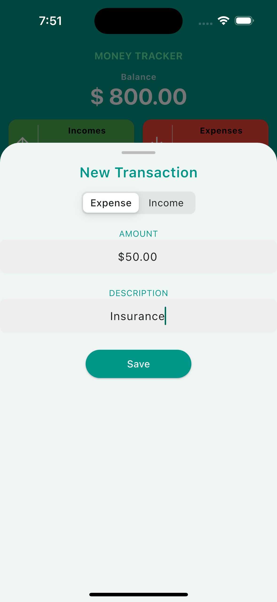
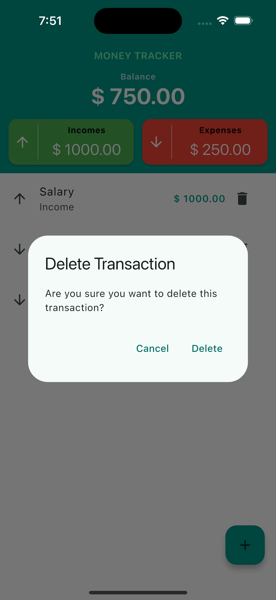

# Money Tracker 🤑  

A personal project to explore Flutter and learn its fundamentals. This simple app allows users to track their income and expenses without using a database. Instead, it relies on an in-memory list of objects, meaning that all data is lost when the app is closed.  

## Features 🚀  

- Add and delete income and expense records  
- Simple UI for easy tracking  
- No database – data exists only during the app session  

## Screenshots 📸  

### Home Screen  
  

### Add Transaction Screen  

### Delete Transaction Dialog

## License 📜

This project is for learning purposes and has no official license.